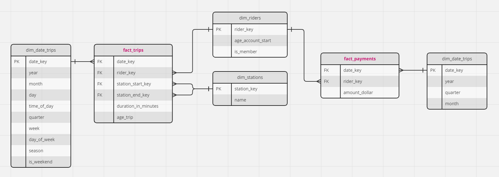
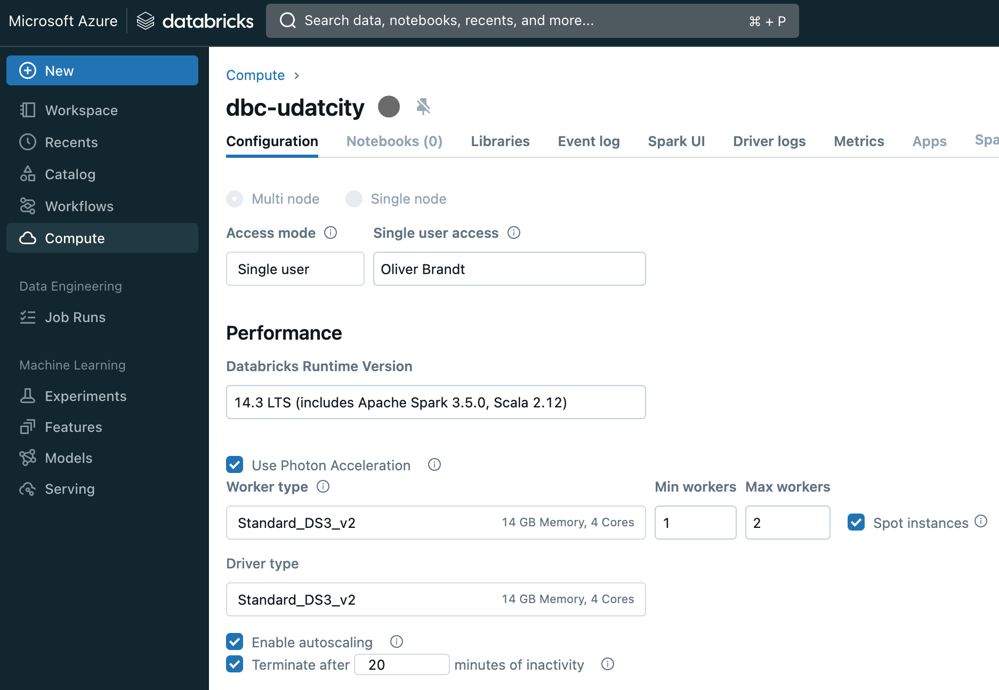
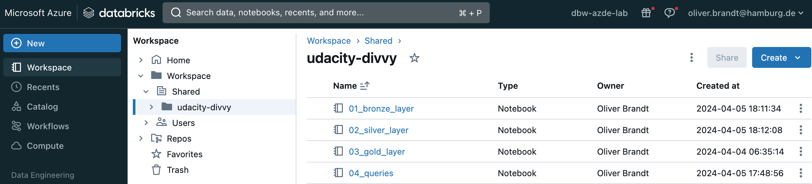
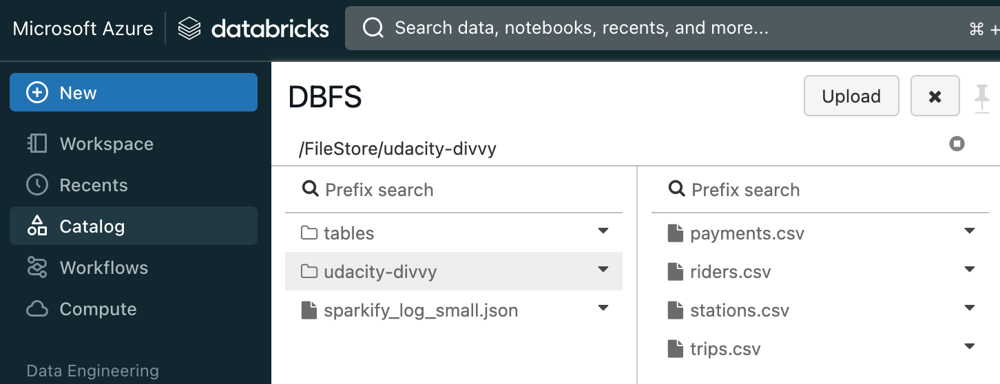
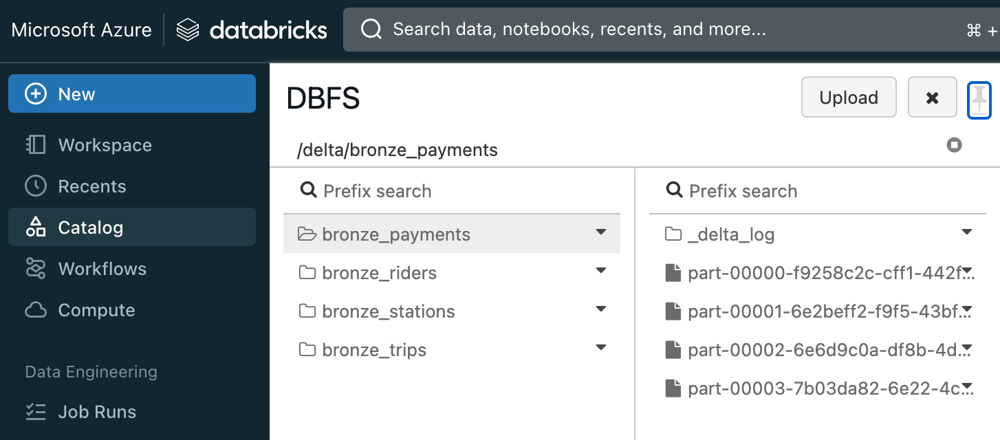
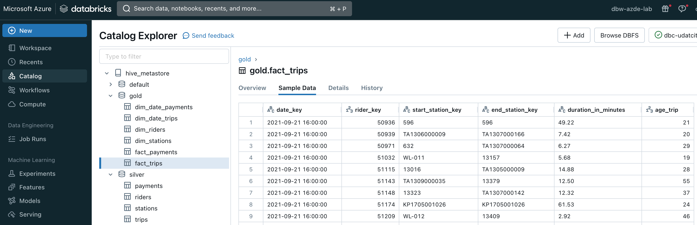

# Azure Data Lakehouse Project

The goal of this project is to develop a data lake solution using Azure Databricks using a lake house architecture. You will:

- Design a star schema based on the business outcomes below;
- Import the data into Azure Databricks using Delta Lake to create a Bronze data store;
- Create a gold data store in Delta Lake tables;
- Transform the data into the star schema for a Gold data store;

You'll implement these requirements by creating a Python notebook, or notebooks in the Azure Databricks workspace. Detailed requirements for what should be in the notebook can be found in the project rubric. You'll submit your notebook(s) and they'll be assessed against this [rubric](https://review.udacity.com/#!/rubrics/5401) when you submit your project.

Project description taken from [Udacity](https://learn.udacity.com/nanodegrees/nd0277/parts/cd11531/lessons/87bca798-16a9-4dae-aba3-b73a10370fe1/concepts/b7e28f58-02d5-45a5-a931-ea24d50c3eff).

## Delta Lake Architecture

As an architecure the modern approach of Bronze/Silver/Gold-layers have been used:

- **Bronze Layer**: This is the raw data ingestion layer where data is stored in its raw, unprocessed form. No schema or data type enforcement is typically done at this layer.
- **Silver Layer**: This is the cleaned and processed data layer. At this stage, data is transformed from its raw form into a structured form, which involves defining the data types for each column. This layer is typically used for exploratory data analysis and to create derived datasets.
- **Gold Layer**: This layer contains business-level aggregates, often used for reporting and dashboarding. The schema for this layer is typically derived from the silver layer. As such, while some additional transformation and aggregation may occur in this layer, the underlying data types are usually already defined in the silver layer.

## Business Outcomes
These are the requirements as specified in the Udacity project description:

1. Analyze how much time is spent per ride
   - Based on date and time factors such as day of week and time of day
   - Based on which station is the starting and / or ending station
   - Based on age of the rider at time of the ride
   - Based on whether the rider is a member or a casual rider
2. Analyze how much money is spent
   - Per month, quarter, year
   - Per member, based on the age of the rider at account start
3. EXTRA CREDIT - Analyze how much money is spent per member
   - Based on how many rides the rider averages per month
   - Based on how many minutes the rider spends on a bike per month

Based on these requirements the following star schema has been designed:



Queries that show how these requirements have been fullfilled can be found in the notebook [04_queries.ipynb](./04_queries.ipynb).

## Databricks Cluster Configuration.
For all Azure Databricks workloads my personal Visual Studio Enterprise benefits have been used. The screenshot shows the compute cluster that has been configured for this task:



## Impementation of the Solution
The solution has been implemented by the following steps:
1. Upload the CSV files
2. Run bronze layer notebook [01_bronze.ipynb](./01_bronze_layer.ipynb)
3. Run silver layer notebook [02_silver.ipynb](./02_silver_layer.ipynb)
4. Run gold layer notebook [03_gold.ipynb](./03_gold_layer.ipynb)

The notebooks have been develeoped in Databricks and exported to this repo.



## Upload CSV-files
Instead of uploading the files manually to DBFS this script has been used:

```bash
databricks fs mkdir dbfs:/FileStore/udacity-divvy

databricks fs cp stations.csv dbfs:/FileStore/udacity-divvy
# stations.csv -> dbfs:/FileStore/udacity-divvy/stations.csv

databricks fs cp riders.csv dbfs:/FileStore/udacity-divvy
# riders.csv -> dbfs:/FileStore/udacity-divvy/riders.csv

databricks fs cp payments.csv dbfs:/FileStore/udacity-divvy
# payments.csv -> dbfs:/FileStore/udacity-divvy/payments.csv

databricks fs cp trips.csv dbfs:/FileStore/udacity-divvy
# trips.csv -> dbfs:/FileStore/udacity-divvy/trips.csv
```

After executing the script the CSV-files are available:



## Bronze layer
After executing [01_bronze.ipynb](./01_bronze_layer.ipynb) the Delta Lake files are available here:



## Silver/Gold Layer
After executing the respective notebooks  [02_silver.ipynb](./02_silver_layer.ipynb) and [03_gold.ipynb](./03_gold_layer.ipynb) the result is visible in the Databricks metastore:



## Queries
An additional notebook [04_queries.ipynb](./04_queries.ipynb) has been provided to test the expected business outcomes.